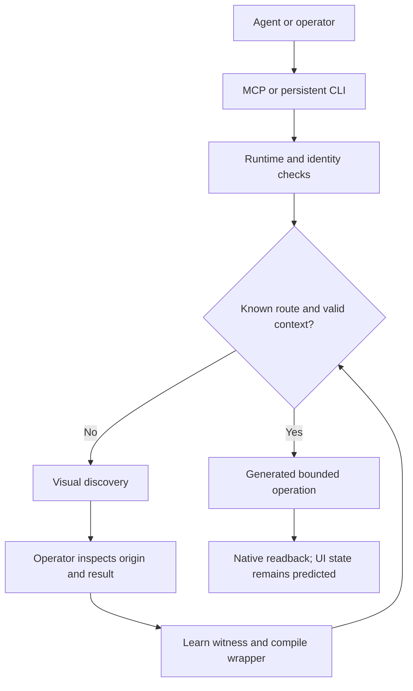

# Architecture

`tv_use.py` implements the bounded webOS SSAP/TLS client, pointer protocol,
native app routes, image download and UI-step executor. `tv_power.py` implements
the paired device registry and standard-library Wake-on-LAN.

`tv_runtime.py` keeps sockets open across calls, checks native device/app state,
coordinates screenshot witnesses and invalidates tracked UI context. `app_learning.py`
stores scoped route records and compiles allowed operations into small wrappers.
`server.py` serializes mutations through one lock and exposes the 17 stdio MCP
tools. `tv_cli.py` exposes standalone commands and JSON-lines sessions.

## What generation means

Learning saves the operation, app metadata fingerprint, TV host/model/firmware
scope, witness hash and notes. UI records also store bounded steps and named origin
and destination states. Templates generate calls to `native_app_action` or
`run_ui_steps`; remote strings are Python `repr` data, rather than source fragments.
Changed generated source is compiled and loaded by its hash to avoid stale bytecode.

This is route compilation, not unrestricted self-modification. The model does not
submit arbitrary Python or SSAP/Luna endpoints through MCP. The runtime **does**
execute its locally generated file; anyone able to tamper with that file has local
code-execution influence. Protect the state directory like other trusted configuration.

## Evidence boundaries

- A screenshot witness identifies bytes; it does not algorithmically prove that an
  agent inspected them or assigned the correct state name.
- Native foreground checks verify app identity, not page, focus, text or playback.
- A successful UI batch produces a predicted destination state. An incorrectly
  described origin can still produce the wrong screen within the same app.
- External remote input and asynchronous popups cannot always be detected. Reobserve
  after external interaction or uncertainty, even if the 60-second context is fresh.
- App launch learning may describe only a loading logo. `launch_evidence` and
  `ui_discovery_required` keep this separate from learned internal navigation.
- If firmware cannot be read, the scope uses `unknown`; it cannot detect an otherwise
  invisible firmware change. Rediscover after updating the TV.

## Transport and recovery

Control uses the selected TV's pinned TLS listener on port 3001. Pointer endpoints
advertised as plaintext are mapped to that encrypted listener. An idle pointer is
checked with a nonce ping/pong before input; failed preflight reacquires the channel
before sending a command. A lost in-flight input is never replayed automatically.

Read-only health checks may reconnect. Mutations with uncertain delivery report
that uncertainty and may collect new state/images, rather than repeating the action.
Power wake uses up to two registered network MACs, UDP port 9 and then native
power-state readback. Physical wake support is outside the host's control.

App addons are scoped to an IP as well as model/firmware. If DHCP changes a TV's IP,
pair/register it at the verified new address and rediscover routes. Device identity
uses native model and network MACs; two advertisements sharing an IP are not treated
as proof that both are reachable at that address.
